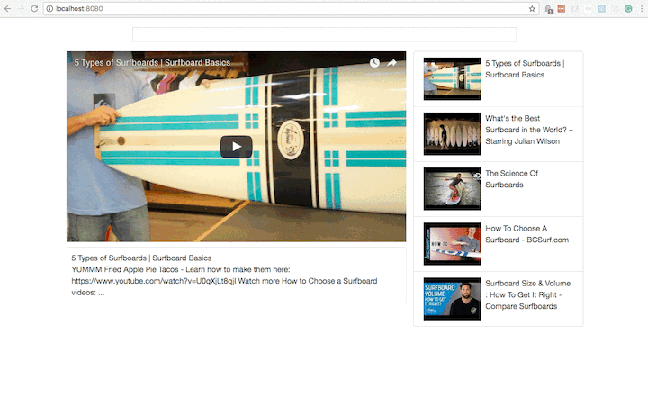

# Redux and React Youtube Clone
This was done in in following the Udemy tutorial series by Stephen Grider. [More info](https://www.udemy.com/react-redux/).



#####Status: **MVP**

#####Currently Working:

- [x] SearchBar Class based component to handle the input search text.
- [x] VideoDetail Functional Component to show the detials for the video currently playing.
- [x] Video List and Video List items show the other 5 search results from the Youtube API.
- [x] Debounce the search result to slow the searching. Using the lodash npm library for this.

### Getting Started - Check it out yourself!

There are two methods for getting started with this repo.

#### Familiar with Git?
Checkout this repo, install dependencies, then start the gulp process with the following:

```
> git clone https://github.com/willcook4/ReactReduxYoutubeClone.git
> cd ReactReduxYoutubeClone
> npm install
> npm start
```

#### Not Familiar with Git?
Click [here](https://github.com/willcook4/ReactReduxYoutubeClone) then download the .zip file.  Extract the contents of the zip file, then open your terminal, change to the project directory, and:

```
> npm install
> npm start
```
